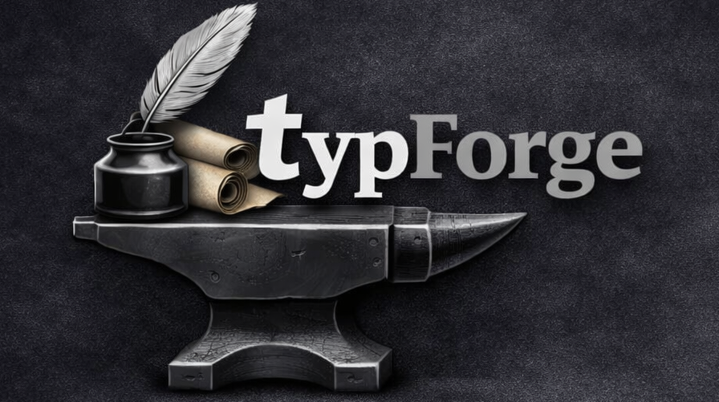

  

  
# TypForge

**A lightweight, pure-Rust, offline-first word processor for Typst.**

TypForge is a distraction-free, local-first writing environment built with **GPUI**, the high-performance, GPU-accelerated UI framework developed by the [Zed](https://zed.dev) team.

Built for privacy and speed, TypForge operates entirely on your local machine—no internet connection, cloud dependencies, or mandatory accounts required. TypForge is **Rust all the way down**. By using the same language as the Typst compiler itself, we provide a seamless, high-efficiency experience that feels native to your desktop without the "browser bloat.

## Why Typst? (And Why TypForge?)

If you are curious about [Typst](https://typst.app), you're in the right place. Typst is a modern, refreshing successor to LaTeX and traditional word processors. 

* **No Complex Build Chains:** Unlike LaTeX, which requires massive multi-gigabyte distributions, fragile package managers, and multi-pass compilation scripts, Typst is a single, lightning-fast binary. 
* **Human-Readable Syntax:** No more wrestling with arcane backslash commands. Typst uses clean, intuitive markup that feels as natural as Markdown but packs the punch of a professional typesetting engine.
* **Instant Gratification:** Typst compiles documents in milliseconds, meaning your changes render almost instantly.

**TypForge** takes this incredible engine and wraps it in a desktop application designed for everyone. Our goal is to lower the barrier to entry so writers, researchers, and students can experience professional typesetting without ever needing to touch a terminal.

## The Vision
Our goal is to make Typst accessible to a general audience, bridging the gap between technical power and mainstream accessibility. You shouldn't have to navigate a complex code editor just to create a beautiful document. Should you want to bring in those more advanced feautres of Typst the editor is still available to you. 

### v0.1.0: The Foundation
The initial release focuses on a robust "Split-View" writing experience inspired by the clean aesthetic of the Zed editor:
*   **Zed-Inspired Interface:** A minimal, focused UI with a fast file explorer and customizable window controls.
*   **Dual-Pane Editing:** Raw Typst markup on the left, with an instant live-preview panel on the right.
*   **Native Performance:** Leveraging GPUI for GPU-accelerated rendering and a minimal memory footprint.

### The Future: A Hybrid Word Processor
As the project evolves, we are working toward a **Hybrid Word Processor** model to invite a wider audience of writers into the Typst ecosystem:
* **Direct Preview Editing:** The ability to edit content directly within the preview panel for a seamless "What You See Is What You Get" (WYSIWYG) experience.
* **Contextual Markup:** The raw markup editor stays tucked away, revealing itself only when you need to perform complex custom styling or review the underlying code.
* **Universal Accessibility:** Seamlessly transitioning from a standard markup editor into a tool that feels as intuitive as a traditional word processor, backed by world-class typography.

## Why Pure Rust?
Because when your document compiler (Typst) and your user interface framework (GPUI) are both written in native Rust, magic happens. This choice results in:

* **Unmatched Efficiency:** Tiny binary sizes and a fraction of the RAM usage compared to apps running embedded web browsers or heavy runtime environments.
* **A Unified Stack:** A seamless architecture where the UI layer and the document engine speak the exact same language, eliminating serialization overhead and communication bottlenecks.
* **Lightning Performance:** Harnessing Rust's multi-threading capabilities and zero-cost abstractions to ensure that your typing and rendering experience is entirely lag-free.

## Current Status

TypForge is currently under active development. Core components—including the workspace file panel, the editor component, and the live rendered preview pipeline—have been implemented. We are currently polishing the interface, squashing bugs, refining performance and implenmenting basic editor features ahead of our official v0.1.0 release.

## Alternatives
If you want to explore other projects in the ecosystem, check out these excellent tools:

* [TypstWriter](https://github.com/Bzero/typstwriter)
* [TypWriter](https://github.com/Ahdeyyy/typwriter)
* [TypStudio](https://github.com/Cubxity/typstudio)
* [InkPond](https://github.com/Lin0u0/InkPond) (Tailored for macOS and iOS)

## Project Structure
TypForge is organized in a Rust workspace consisting of several specialized crates:

- **`typforge`**: 
  - The primary entry point and orchestrator. This binary crate integrates all components into a cohesive application using the [GPUI](https://github.com/zed-industries/gpui) framework.
- **`typst-gpui`**: 
  - The rendering engine. It handles the translation of Typst documents into visual elements rendered via GPUI.
- **`typstography`**: 
  - A Language Server Protocol (LSP) implementation providing IDE-like features for Typst, built upon `tower-lsp` and `lsp-types`.
- **`typsdocx`**: 
  - An export utility that maps Typst documents to Microsoft Word (`.docx`) files using `docx-rs`.

## How to Contribute
TypForge is in its early, experimental days, and a huge chunk of it is being built using AI-assisted development (shoutout to Gemini!). Because of that, you don't need to be a seasoned Rust systems engineer to contribute. We are learning, experimenting, and building this in the open.

Here is how you can help shape TypForge:

* **Share Your Ideas:** Since the goal is to make Typst accessible to everyone, we welcome feedback to acheive this. 
* **Break Things & Report Bugs:** Download the code, try to run it, and tell us what crashes or feels clunky by opening a GitHub Issue.
* **Contribute Code (AI-Assisted or Otherwise):** Want to add a feature? Go for it! Whether you write it line-by-line or collaborate with an LLM to generate it, pull requests are welcome. 

### Getting Started for Beginners
If you are new to Rust:
1. Fork the repo and clone it locally.
2. Run `cargo run` in your terminal to see the app in action.
3. If you make changes, just open a Pull Request. Don't worry about perfect code formatting or writing test suites yet—we'll figure that out together as the project grows!

## License
Licensed under either of

 * Apache License, Version 2.0 ([LICENSE-APACHE](LICENSE-APACHE) or http://www.apache.org/licenses/LICENSE-2.0)
 * MIT license ([LICENSE-MIT](LICENSE-MIT) or http://opensource.org/licenses/MIT)

at your option.
